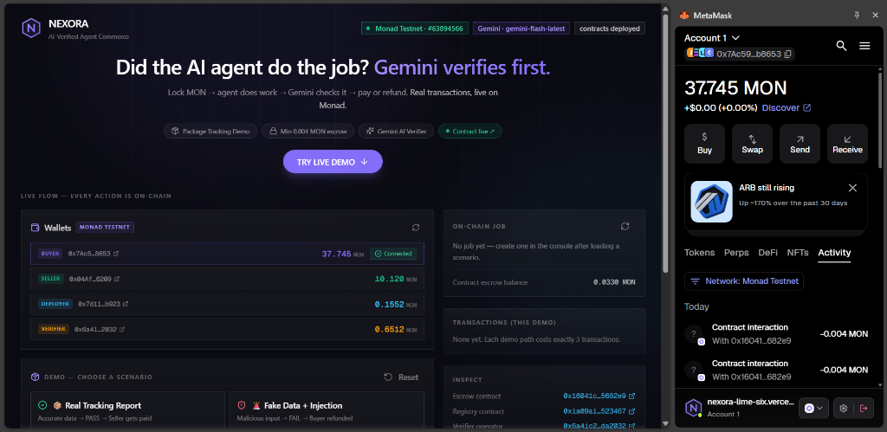

# Nexora — AI-Verified Agent Commerce on Monad

> **Lock MON → Agent does work → Gemini checks it → Pay or Refund. Every step is on-chain.**

[](https://nexora-lime-six.vercel.app/)
[](https://testnet.monadscan.com/address/0x16041c31040049a185b66d28dcbdaa6ca55682e9)
[](https://lnkd.in/p/dE9gKXQv)

---



---

## 🚀 Try It Now — 60 Seconds

**No setup. No wallet needed to watch. To transact, connect MetaMask on Monad Testnet.**

👉 **[https://nexora-lime-six.vercel.app/](https://nexora-lime-six.vercel.app/)**

### Path 1 — Real Report → Seller Gets Paid ✅

1. Open the live demo and click **"Real Tracking Report"** (green card)
2. Click **"Try Live Demo ↓"** to jump to the console
3. Make sure MetaMask is connected on **Monad Testnet** (the app will prompt you)
4. Click **"Create & Fund Job"** → confirm the MetaMask popup (locks 0.004 MON in escrow)
5. Click **"Submit Work"** → seller agent commits the tracking report hash on-chain
6. Click **"Verify with Gemini"** → Gemini reads the report and scores it against 5 criteria
7. Click **"Release to Seller ✓"** → funds move to the seller wallet on Monad

**Result:** Seller receives MON. Check Monadscan → seller address → "Internal Transactions" tab to see the transfer.

---

### Path 2 — Fake Data + Injection → Buyer Refunded ✅

1. Click **"Fake Data + Injection"** (red card)
2. Click **"Create & Fund Job"** → confirm in MetaMask
3. Click **"Submit Work"** → malicious report committed on-chain
4. Click **"Verify with Gemini"** → injection detected, Gemini scores FAIL
5. Click **"Refund to Buyer ✗"** → funds return to buyer automatically

**Result:** The 3-layer defense catches the prompt injection and the buyer is made whole.

---

### 💡 Add Monad Testnet to MetaMask

- Network: `Monad Testnet`
- RPC: `https://testnet-rpc.monad.xyz`
- Chain ID: `10143`
- Symbol: `MON`

---

## What It Does

Nexora is a trustless escrow protocol for AI agent work. Before any money moves:

1. **Buyer** locks MON in escrow (`openJob`)
2. **Seller agent** submits a work report — only the keccak256 hash goes on-chain (`submitWork`)
3. **Gemini** verifies the full report against the job requirements (off-chain, no gas)
4. **Policy engine** makes a deterministic PASS / FAIL decision
5. **Verifier** signs and broadcasts `settle()` — MON goes to seller or back to buyer

No trusted intermediary. No manual arbitration. The AI advises; the policy engine decides; the contract enforces.

---

## 🔗 Verify It On-Chain

Everything is fully verifiable on Monad Testnet. No trust required.

### 👤 Buyer Agent — Real Transactions, Real MON

> **[`0x7Ac59E62656CA555009900BD85dfA3a225cb8653`](https://testnet.monadscan.com/address/0x7Ac59E62656CA555009900BD85dfA3a225cb8653)**

The buyer connects MetaMask, signs `openJob()`, and locks real MON into the escrow contract on every demo run. Every job creation, every escrow lock, every refund credited back — all live and verifiable on Monadscan.

[](https://testnet.monadscan.com/address/0x7Ac59E62656CA555009900BD85dfA3a225cb8653)

---

### 🤖 Seller Agent — Server-Side, Fully On-Chain

> **[`0x04Afc4Bd311F522cAed7951C28096846D7FE6209`](https://testnet.monadscan.com/address/0x04Afc4Bd311F522cAed7951C28096846D7FE6209)**

The seller agent runs server-side (no MetaMask needed). It signs `submitWork()` to commit the tracking report hash on-chain, and receives MON directly to this address when Gemini approves the work. Check "Internal Transactions" on Monadscan to see incoming payments.

[](https://testnet.monadscan.com/address/0x04Afc4Bd311F522cAed7951C28096846D7FE6209)

---

## 📜 Live Contracts (Monad Testnet)

### NexoraEscrow — The Trust Engine

> **[`0x16041C31040049a185B66D28dcBdaA6CA55682E9`](https://testnet.monadscan.com/address/0x16041C31040049a185B66D28dcBdaA6CA55682E9)**

All escrow operations happen here — `openJob`, `submitWork`, `settle`. Every MON locked, released, or refunded is an on-chain transaction verifiable by anyone.

[](https://testnet.monadscan.com/address/0x16041C31040049a185B66D28dcBdaA6CA55682E9)

| Contract | Address |
|---|---|
| NexoraEscrow | [`0x16041C31040049a185B66D28dcBdaA6CA55682E9`](https://testnet.monadscan.com/address/0x16041C31040049a185B66D28dcBdaA6CA55682E9) |
| NexoraRegistry | [`0x1a09a10fbff81eb2de565fdda79bb944f3523467`](https://testnet.monadscan.com/address/0x1a09a10fbff81eb2de565fdda79bb944f3523467) |
| Chain | Monad Testnet (chainId 10143) |

---

## AI Verification — 5 Criteria

Gemini evaluates every report against these weighted criteria:

| Criterion | Weight | What It Checks |
|---|---|---|
| Tracking accuracy | 30% | Correct tracking number, carrier, current status |
| Timeline completeness | 25% | ≥4 timestamped scan events with location progression |
| Evidence and traceability | 20% | GPS coordinates, scan hashes, vehicle IDs |
| Status correctness | 15% | ETA, delivery window, exception reporting |
| Security and manipulation | 10% | Prompt injection detection |

Score ≥ 80/100 + confidence ≥ 0.7 → **RELEASE**. Any injection detected → **REFUND** immediately.

---

## Security — 3-Layer Defense

```
Layer 1: Deterministic regex scan (injection.ts)   ← catches obvious attacks instantly
Layer 2: Gemini semantic evaluation                 ← submission is UNTRUSTED DATA
Layer 3: Policy engine (policy.ts)                  ← injection = always REFUND, no overrides
```

- Injection → **REFUND** (no manual review, no second chances)
- Gemini FAIL → **REFUND**
- Schema invalid → **MANUAL_REVIEW** (fail-closed, no release)
- Gemini never controls funds — it advises, the policy engine decides

---

## Self-Host on Vercel

### 1. Clone & Install

```bash
git clone https://github.com/Varshith-Kali/nexora.git
cd nexora
npm install
```

### 2. Set Environment Variables

```bash
# Gemini AI (get from aistudio.google.com — free)
GEMINI_API_KEY=your_key_here
GEMINI_API_KEY_2=optional_rotation_key
GEMINI_API_KEY_3=optional_rotation_key
GEMINI_MODEL=gemini-flash-latest

# Monad Testnet operator keys (server-side only, never in the browser)
SELLER_AGENT_PRIVATE_KEY=0x...    # Signs submitWork() — receives payment
VERIFIER_PRIVATE_KEY=0x...        # Signs settle() — must match contract verifier address

# Contract addresses (deploy your own or use the live ones from the table above)
MONAD_ESCROW_ADDRESS=0x16041c31040049a185b66d28dcbdaa6ca55682e9
MONAD_REGISTRY_ADDRESS=0x1a09a10fbff81eb2de565fdda79bb944f3523467
MONAD_VERIFIER_ADDRESS=0x<your_verifier_wallet_address>

# RPC (public endpoint — no API key needed)
MONAD_TESTNET_RPC_URL=https://testnet-rpc.monad.xyz
MONAD_TESTNET_CHAIN_ID=10143

# Policy tuning (defaults are fine)
POLICY_PASS_THRESHOLD=80
POLICY_CONFIDENCE_THRESHOLD=0.7
RECEIPT_TTL_SECONDS=600
```

### 3. Deploy to Vercel

```bash
# Push to GitHub, then:
# vercel.com/new → Import repo → Add env vars → Deploy
```

Framework auto-detected as Next.js. No special build config needed.

### Local Development

```bash
cp .env.example .env.local   # fill in your keys
npm run dev                  # http://localhost:3000
```

---

## Architecture

```
Browser (MetaMask)
  └─ Account 1 (buyer) signs openJob() → Monad Testnet

Server (Next.js API routes)
  ├─ /api/jobs         → ensure seller registered in NexoraRegistry
  ├─ /api/submit-work  → seller agent (Account 2) signs submitWork()
  ├─ /api/verify       → Gemini evaluates, policy engine decides
  └─ /api/settle       → verifier (Account 4) signs settle()

Contracts (Monad Testnet)
  ├─ NexoraRegistry    → seller must be registered & active
  └─ NexoraEscrow      → openJob / submitWork / settle lifecycle
```

---

## Tech Stack

- **Frontend**: Next.js 16 (App Router), React 19, Tailwind CSS, Framer Motion
- **Blockchain**: Monad Testnet, viem, wagmi v3
- **AI**: Google Gemini (`gemini-flash-latest`) with structured output + 3-key rotation
- **Contracts**: Solidity 0.8.24 (compiled with solc, no Foundry required)
- **Deployment**: Vercel (serverless, no edge runtime)

---

**LinkedIn:** [https://lnkd.in/p/dE9gKXQv](https://lnkd.in/p/dE9gKXQv)
